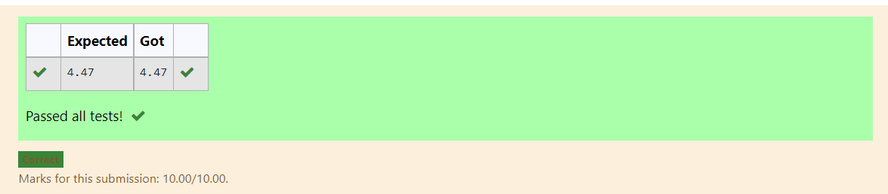

# DISTANCE-BETWEEN-TWO-POINTS

## AIM:
To write a python program to find the distance two 2 points
## ALGORITHM:
### Step 1: 
Import numpy
### Step 2:
Assign the distances.
### Step 3:
solve using sqrt.
Substitute the values in the distance formula  
### Step 4:
print output with 2 decimals.
### Step 5: 
Print the output.
### PROGRAM:
 ```
  #Program to find the distance between two points.
#Developed by: kirupanandhan
#RegisterNumber:21001418
import math
x=[10,6]
y=[4,2]
val=math.sqrt(((x[0]-x[1])**2)+((y[0]-y[1])**2))
print('{:.2f}'.format(val))
```

### OUTPUT:


### RESULT:
The above program has been sucessfully run
